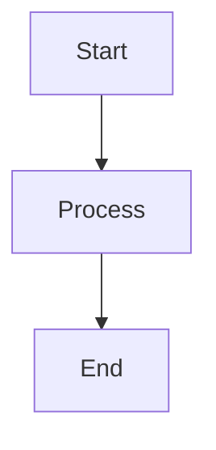

# Create Merge/Pull Request with Smart Description

Create a merge request (GitLab) or pull request (GitHub) with a concise, reviewer-friendly description (max 10 bullet points).

## Step 0: Detect Platform and Tool

Auto-detect the hosting platform and select the best available tool.

**Platform Detection:**
```bash
REMOTE_URL=$(git remote get-url origin 2>/dev/null)
```

| Remote URL pattern | Platform | Primary Tool | Fallback |
|-------------------|----------|-------------|----------|
| `github.com` | GitHub | `gh` CLI | - |
| `gitlab` (any instance) | GitLab | `glab` CLI | GitLab MCP tools |

**Tool Availability Check:**
- GitHub: `gh auth status`
- GitLab: `glab auth status`
- GitLab MCP: Check if `mcp__gitlab__*` tools are available

**Decision Matrix:**
| Platform | Condition | Use |
|----------|-----------|-----|
| GitHub | `gh` available | `gh` CLI |
| GitLab | `glab` available & authenticated | `glab` CLI (preferred) |
| GitLab | `glab` unavailable, MCP available | GitLab MCP tools |
| GitLab | Both available | `glab` CLI (preferred) |

## Step 1: Branch Management

Ask the user about branch preference:
- Do they want to checkout a specific branch?
- Stay on the current branch?
- If they already mentioned a branch, use that

Current branch: `{{ git.currentBranch }}`

### Issue-Key Requirement: Repository Context

Before requiring or adding a Jira or other issue key, classify the repository from verifiable context rather than its hosting platform alone:

- **Organization/work repository:** If the remote organization, repository documentation, or established branch/MR/CI conventions require an issue key, follow that policy.
- **Personal repository:** If the user identifies the project as personal, or the remote belongs to their personal GitHub or personal GitLab namespace and there is no work-related evidence, **do not ask for, look up, or invent a Jira key**. Follow the repository's own convention; if none exists, use a clear conventional prefix such as `chore`, `fix`, or `feat`.
- **Unclear ownership:** Inspect the remote namespace and checked-in contribution/CI conventions. Ask one concise question only if the evidence still does not resolve the context.

Never infer that a Jira key is required merely because the host is GitLab. For a conventional personal-project branch, use a slash form such as `chore/update-skills`; for commit and MR/PR titles, use the repository's conventional form such as `chore(skills): update installed skills`.

## Step 2: Check for Existing MR/PR

Before creating a new MR/PR, check if one already exists:

**GitHub:**
```bash
gh pr list --head $(git branch --show-current)
```

**GitLab (glab):**
```bash
glab mr view --source-branch $(git branch --show-current) 2>/dev/null || echo "No MR found"
```

**GitLab (MCP fallback):**
- Use `mcp__gitlab__get_merge_request` with `source_branch: current branch`

If an MR/PR exists and is:
- **Open:** Inform the user and ask if they want to update the description
- **Merged:** Inform the user that changes are already merged
- **Closed:** Ask if they want to create a new one or reopen

If none exists, proceed to create a new one.

## Step 3: Analyze Changes

Analyze git diff and commit messages to understand what changed:
```bash
# Detect default branch
DEFAULT_BRANCH=$(git symbolic-ref refs/remotes/origin/HEAD 2>/dev/null | sed 's@^refs/remotes/origin/@@' || echo "main")
git diff origin/${DEFAULT_BRANCH}...HEAD
git log origin/${DEFAULT_BRANCH}..HEAD --oneline
```

## Step 4: Discover Title Policy and Generate Title

Before choosing a title format, inspect the repository's checked-in MR/PR and release conventions. Search CI configuration, contributor documentation, and changelog/version tooling for title validators or semantic-version prefixes. Treat an anchored CI rule as authoritative over branch-name heuristics.

### Release/Semver-Prefixed Repositories

When a repository requires a leading release prefix, put it first. This order is machine-readable, not cosmetic: CI may validate the first token, derive the next semantic version, and classify generated changelog entries from it.

| Change impact | Leading prefix |
|--------------|----------------|
| Backward-compatible fix or maintenance | `PATCH:` |
| Backward-compatible feature | `MINOR:` or `FEATURE:` |
| Incompatible change | `MAJOR:` or `BREAKING:` |

Keep a required issue key immediately after the release prefix for traceability:

```text
FEATURE: TICKET-123 - Add feature description
```

Before creating the MR/PR, validate the proposed title against the repository's actual rule. If correcting an existing title after a validation failure, update it and retry the failed validation job or pipeline; changing MR/PR metadata alone may not trigger a new CI run.

### Title Format

If the repository has no explicit title policy, auto-detect the title style from the branch name:

- **Ticket-prefixed branches** (e.g., `APP-123-add-feature`): `APP-123 - Add feature description`
- **Conventional branches** (e.g., `feature/add-auth`, `fix/login-bug`): `feat: Add auth` / `fix: Resolve login bug`
- **Other branches**: Use a concise descriptive title

### Description Format (MAX 10 BULLET POINTS)

```markdown
## Summary
Brief 1-2 sentence description of what this MR/PR does.

## Changes Made
- [List 3-5 key changes with specific details]
- [Group by category if needed: Frontend, Backend, Database, Tests]
- [Be precise - avoid vague terms like "improved" or "fixed"]

## Technical Details (Optional - use ONE format if helpful)

**Option A - Before/After:**
- **Before:** Old behavior
- **After:** New behavior

**Option B - Table (for config/data changes):**
| Field | Before | After | Reason |
|-------|--------|-------|--------|
| ... | ... | ... | ... |

**Option C - Mermaid (for complex flows):**


## Testing
- [ ] Tests pass locally
- [ ] Manually verified key flows

## Related Links
- Ticket: [TICKET-ID](link) (if applicable)
- Related MRs/PRs: (if any)
- Documentation: (if updated)
```

**IMPORTANT:** Keep total bullet points under 10. Combine related items if needed.

## Step 5: Create the MR/PR

**GitHub:**
```bash
gh pr create \
  --title "[type]: Description" \
  --body "$(cat <<'EOF'
## Summary
...

## Changes Made
...
EOF
)"
```

**GitLab (glab - preferred):**
```bash
MR_TITLE="chore(skills): update installed skills"
glab mr create \
  --source-branch "$(git branch --show-current)" \
  --target-branch "$DEFAULT_BRANCH" \
  --title "$MR_TITLE" \
  --remove-source-branch \
  --description "$(cat <<'EOF'
## Summary
...

## Changes Made
...
EOF
)"
```

**GitLab (MCP fallback):**
Use `mcp__gitlab__create_merge_request` with:
- `project_id`: Auto-detect from git remote URL
- Source branch: current branch
- Target branch: default branch (auto-detect)
- Title and description as generated

After creating via MCP, set additional options:
```bash
glab mr update <iid> --remove-source-branch
```

**Note:** If primary tool fails, automatically fall back to the alternative without asking the user.

## Guidelines

1. **Be Precise:** Explain what and how, not just "fixed" or "improved"
2. **Use Visual Aids Sparingly:** Only if it significantly helps understanding
3. **Stay Concise:** Max 10 bullet points total across all sections
4. **Think Like a Reviewer:** What's the minimum info needed to review?

## Final Step

After creating the MR/PR, provide:
- MR/PR URL
- Brief summary
- Reminder to assign reviewers
